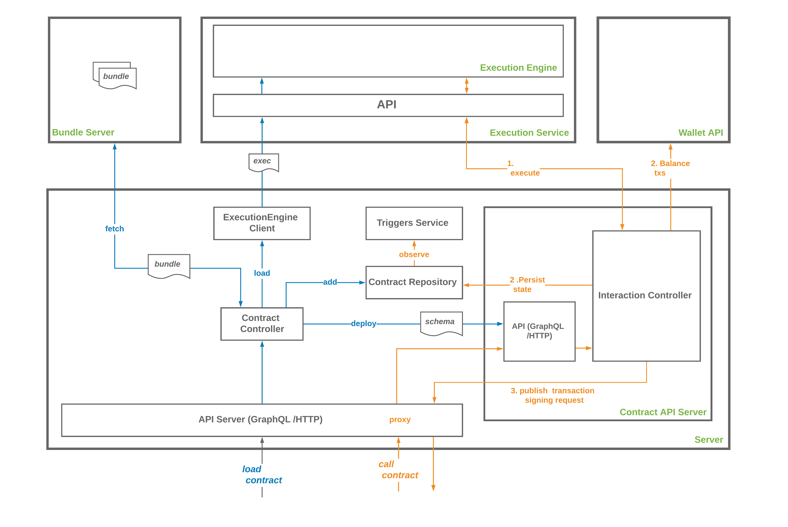

# Server

Connect to an [Execution Service](../execution_service/README.md), configure transaction publication, and expose a GraphQL API over HTTP. See the [default configuration](index.ts) as an example.

 - [More documentation](../../docs)

